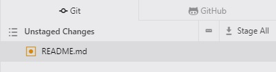

# Documentation
We use DocFX for our help and documentation side of things.

## [DocFX](https://dotnet.github.io/docfx/)
You can download the zip package of the precompiled binaries if you would like to play from [here](https://github.com/dotnet/docfx/releases "DocFX Installer").

To build the project, call the DocFX binary and point it to the repository ```docfx.json``` file and use the parameter ```--serve``` to spawn a web-service that listens on [http://localhost:8080](http://localhost:8080) E.G.

```
c:\docfx\docfx.exe c:\docs\docfx.json --serve
```

## Atom

Atom is a third-party text editor that supports Markdown, you can download the program from [here](https://atom.io/ "Install Atom").

Once Atom is installed run the following from a command prompt or terminal.  This will install some useful packages that will assist in the formatting of your documentation.
```
apm install tool-bar markdown-writer tool-bar-markdown-writer git-clone
```

## Command Palette
In the welcome screen we are introduced to probably the most important command in Atom, the Command Palette. If you press "Cmd+Shift+P" while focused in an editor pane, the command palette will pop up.

## Markdown Preview
Pressing "Shift+Control+M" whilst in an existing document will bring up the markdown preview pane, so you can see how your document will look once it's published.

## [GitHub repository](https://github.com/TransVault/documentation)
You will need to clone our repo by TBD.

## GitHub

"Ctrl-Shift-9" can be used to toggle the GitHub pane within Atom.

Any saved changes made to the documentation will appear in Git as



To stage your changes you can either select "Stage All" or right click file and select "Stage"

Once selected your staged files will here as below:


When any changes have been committed do remember to check the live [GitHub](https://github.com/TransVault/documentation "GitHub") page to confirm everything is ok.
