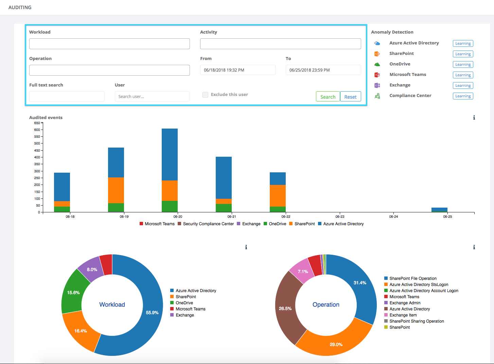
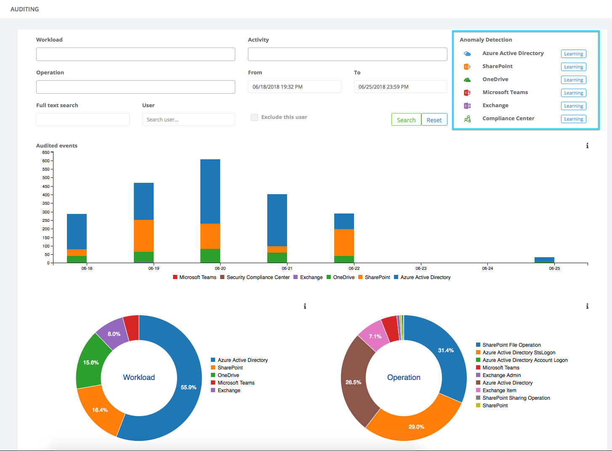
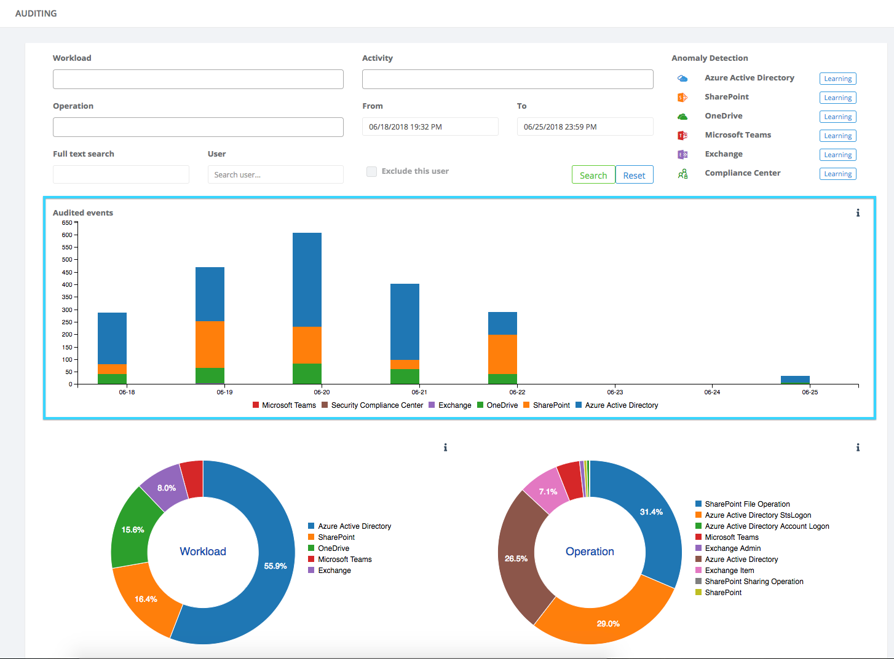
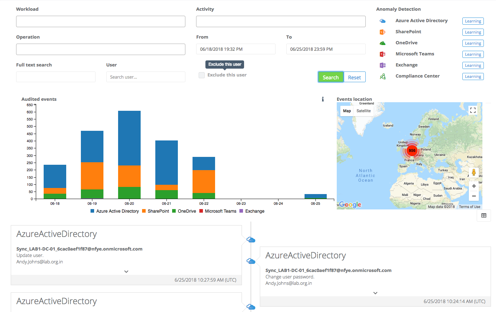
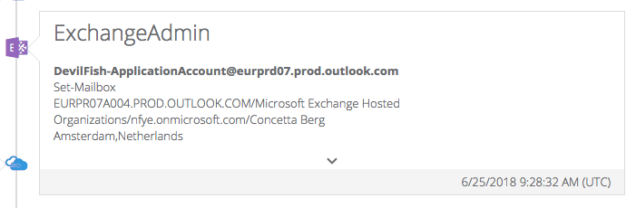
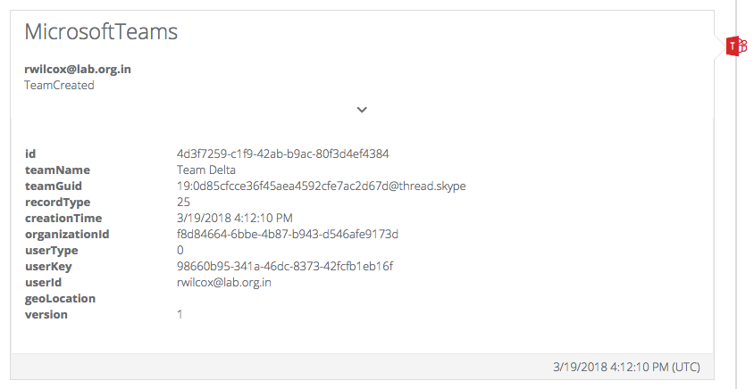

# Welcome

You are now reviewing the documentation for our auditing component.

Our aim with this documentation is to give you an overview of what you can see inside the application,
along with example of how to find out specific things relating to your environment. We've based these examples on information that some of our customers have provided, and asked us about whilst developing the product!

# Getting started

After configuration during the getting started wizard where this application was set-up, we can begin capturing audit events from Microsoft.
In actual fact the process is that we subscribe to notifications about events, Microsoft notifies us when data is available, and we fetch it.
This data is then stored securely in our system and made available for you to perform queries against to discover valuable information relating to usage and operations being performed in your Office 365 tenant.

For further information on using the auditing module, review the menu on the left.

# Overview
Below is a screenshot showing the main auditing screen:


The page is divided into a number of sections as described below.

## Query area
The query area is where you build queries to search your audited events:



There are many attributes of each audit event, we've tried to categorize and group things to help you make the best use of the information. We've split the query into:
* **Workload**
	This is the available workload, such as Exchange, OneDrive for Business, etc.
* **Activity**
	This is a specific activity such as logging into a mailbox, or creating a team in Microsoft Teams
* **Operation**
	This is an individual operation group. It comes in to play when reviewing audited events relating to things like OneDrive, because they may in the background use other workloads (for example SharePoint)
* **Date from, and date to**
	A date and time range can be input or selected from a date/time picker.
* **Full Text search**
	This allows you to search for specific terms in the query results.
* **User**
	If you're interested in the audit events associated with a specific user that user can be selected here.
* **Exclude user checkbox**
	This flips the query to exclude the user that has been selected in the query. In orders it will show every other user, except the one you have chosen.

## Anomaly detection
This area of the main screen, shown below, indicates the state of the anomaly detection learning.



## Audited events over a period of time
The chart in the centre of the screen, shown below, shows information about the number of captured events per day, over the last 7 days:



## Breakdown of captured audit events to date
At the bottom of the main auditing screen are two charts which show a break down of the audited events captured to date. This gives an indication of the relative amounts of events captured per workload.


**Note**: Not all audit events from Microsoft capture a location. In time it is hoped the range of events showing location information will increase, but this is reliant on Microsoft.

# Performing a query

The simplest of queries to see the quantity of information available to you can be performed by simply choosing a date range, and clicking on 'Search'.

When that is performed the data matching your search is obtained from our system, and displayed on screen. In the example below you can see the date range was adjusted to show 18th June to 25th June:


After the query has run, the page updates to show you the quantity of audit events matching your search, a map showing you where some of the auditable activities were performed and beneath that is a time-line of activities:




## Timeline View

The timeline of audited events shows important information relating to individual captured audit events. One event might look like this:



In the box surrounding the event there is small arrow which can be clicked to expand out the event to show all of the captured event metadata, as shown below:


## DataGrid View

Above and to the right of the time is an icon which can be clicked to switch to the data grid view. The icon is highlighted in the screenshot below:


The data grid view looks like this:


On this view you can perform further filtering if required (scroll to the bottom and type into the boxes). You can change the sort order of events, indicate specific events which are of interest, and more!


## Export results

The data grid view also allows you to create a PDF of the results of your audit query. This is made available to you immediately, and can be stored, printed, or sent via email.


# Examples

## Creation and deletion of teams
Below is an example of how to build a query to review events relating to creation and deletion of teams within the Microsoft Teams application.

### The query
In this example we choose two activities from the 'Activity' dropdown list, and we change the date range. The query parameters look like this:


### Reviewing the results
When the search is executed the results come back almost instantly, and look similar to those below:


### Seeing the detail of an events
As well as reiewing the timeline of events to get an overall picture of how teams have been created and removed, individual events can be examined, as shown below:



**Note**: Not all audit events from Microsoft capture a location. In time it is hoped the range of events showing location information will increase, but this is reliant on Microsoft.

## Mailbox changes
Below is an example of how to build a query to review changes made to mailboxes by an administrator in the organization.

### The query
In this query we have changed the workload, as we're only interested in Exchange. We've changed the date range, chosen to do a full text query for 'set-mailbox', and indicated the administrator name.


### Reviewing the results
We can get an overall sense of the activities performed over the date range by reviewing the chart shown below:


We can also see the timeline of events which indicates which mailboxes have been changed:


**Note**: Not all audit events from Microsoft capture a location. In time it is hoped the range of events showing location information will increase, but this is reliant on Microsoft.

# Additional configuration

# Enabling mailbox auditing
By default even when Exchange auditing is enabled, very little information is collected by Microsoft. If you want to gain insight into more details about user activity within Exchange then additional configuration via PowerShell is needed. You can do that as follows:

## Connecting to Office 365 PowerShell
Each of the scripts on this page require that you create a session to Office 365 PowerShell.  This is accomplished as follows:

1. Launch PowerShell.
2. Enter the following

```
$UserCredential = Get-Credential
$Session = New-PSSession -ConfigurationName Microsoft.Exchange -ConnectionUri https://outlook.office365.com/powershell-liveid/ -Credential $UserCredential -Authentication Basic -AllowRedirection
Import-PSSession $Session
````

When the above runs, you will be prompted for credentials to use to make the connection.

## See who has auditing enabled
Issue the following command in PowerShell:

```
Get-Mailbox -ResultSize Unlimited -filter {AuditEnabled -eq $true} | fl name, userprincipalname
```

## See which auditing options are enabled
Issue the following command in PowerShell:

```
Get-Mailbox -ResultSize Unlimited -filter {AuditEnabled -eq $true} | fl name, userprincipalname, audit*
```

## Enable auditing for one mailbox
Issue the following command in PowerShell:

```
Set-Mailbox -Identity "a-user-upn@somedomain.com" -AuditEnabled $true
```

To enable specific events for auditing the following can be issued:

```
Set-Mailbox -Identity "a-user-upn@somedomain.com" -AuditOwner @{Add="MailboxLogin","HardDelete"}
```

## Enable auditing for multiple mailboxes
Issue the following command in PowerShell to enable mailbox auditing on all mailboxes in your Office 365 tenant:

```
Get-Mailbox -ResultSize Unlimited -Filter {RecipientTypeDetails -eq "UserMailbox"} | Set-Mailbox -AuditEnabled $true
```

**Note**: More details are available on this [link](https://support.office.com/en-us/article/enable-mailbox-auditing-in-office-365-aaca8987-5b62-458b-9882-c28476a66918)

## Turning off auditing

During the getting started wizard when the application was setup, various options within auditing may have been enabled. These can be viewed, and changed easily within the application.

### Viewing audit capture

If you wish to view the audit events that are being captured by the application, follow these steps:

1. Click on 'Settings' in the left hand navigation bar.

2. Click on the 'Subscriptions' tab.

3. You will be presented with a list of the subscription types and whether they are enabled for collection

    

### Changing audit capture

You may wish to change the audit events which are captured, to do that follow these steps:

1. Click on 'Settings' in the left hand navigation bar.

2. Click on the 'Subscriptions' tab.

3. You will be presented with a list of the subscription types and whether they are enabled for collection

    

4. Each of the categories can be clicked on, and they will be disabled or enabled as required, as shown below:

    


**Note**: It can take a few hours for Microsoft to make these changes in their systems. This means that if you have enabled additional auditing options it can take a short time before they are visible in the application.
