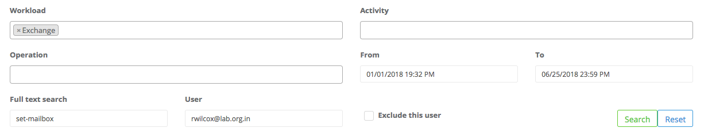
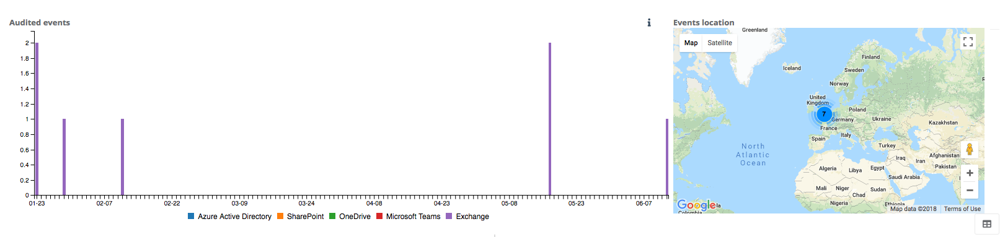

# Mailbox changes
Below is an example of how to build a query to review changes made to mailboxes by an administrator in the organization.

# The query
In this query we have changed the workload, as we're only interested in Exchange. We've changed the date range, chosen to do a full text query for 'set-mailbox', and indicated the administrator name.

# Reviewing the results
We can get an overall sense of the activities performed over the date range by reviewing the chart shown below:

We can also see the timeline of events which indicates which mailboxes have been changed:

**Note**: Not all audit events from Microsoft capture a location. In time it is hoped the range of events showing location information will increase, but this is reliant on Microsoft.