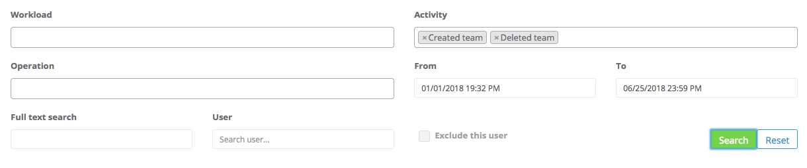
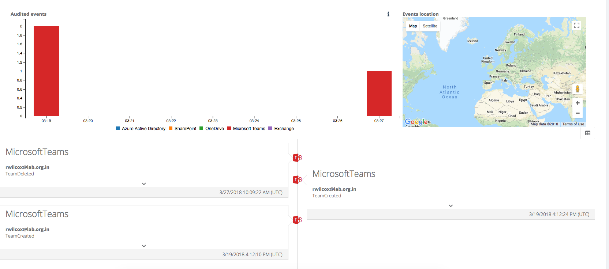

# Creation and deletion of teams
Below is an example of how to build a query to review events relating to creation and deletion of teams within the Microsoft Teams application.

# The query
In this example we choose two activities from the 'Activity' dropdown list, and we change the date range. The query parameters look like this:

# Reviewing the results
When the search is executed the results come back almost instantly, and look similar to those below:

# Seeing the detail of an events
As well as reiewing the timeline of events to get an overall picture of how teams have been created and removed, individual events can be examined, as shown below:

**Note**: Not all audit events from Microsoft capture a location. In time it is hoped the range of events showing location information will increase, but this is reliant on Microsoft.