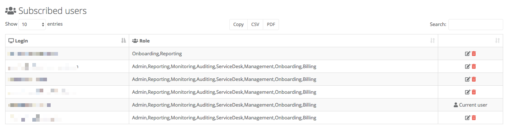

# User management

The person that signs up your Office 365 tenant to our application is known as the tenant admin. They have the ability to grant access to additional people, as shown below.

----

# Adding a new user

From time to time you might want to give the ability for additional people to be able to login, and use the application. If that's what you want to do, follow these steps:

1. Click on 'Settings' in the left hand navigation bar.

2. Click on the 'Security' tab.

3. You will be presented with a list of the users who have access to the application as shown below:

    
	
4. At the bottom left of the data grid click on the 'Add user' button.

5. Provide the user principal name of the person you want to give access to.

6. Select the components of the application that you wish this person to have access to, and confirm by clicking on the 'submit' button.

----

# Changing the roles of a user

From time to time you might want to change the roles associated with people who have access to the application. If that's what you want to do, follow these steps:

1. Click on 'Settings' in the left hand navigation bar.

2. Click on the 'Security' tab.

3. You will be presented with a list of the users who have access to the application as shown below:

    
	
4. You can edit the user roles by clicking on the small 'edit' icon to the right of the user in the data grid.

    

----
	
# Removing a user

From time to time you might want to remove people from access to the application. If that's what you want to do, follow these steps:

1. Click on 'Settings' in the left hand navigation bar.

2. Click on the 'Security' tab.

3. You will be presented with a list of the users who have access to the application as shown below:

    

4. You can remove a user by clicking on the small delete icon to the right of the data grid.

    

5. A pop-up dialog will give you the options for the user. Components of the application can be added and removed, and changes confirmed by clicking on 'submit'

----

**Note**: You can not edit your own roles, or remove yourself from the application. If you wish to do this please contact our [support team](/inflight/support-feedback.html#support)