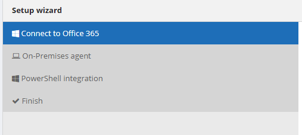
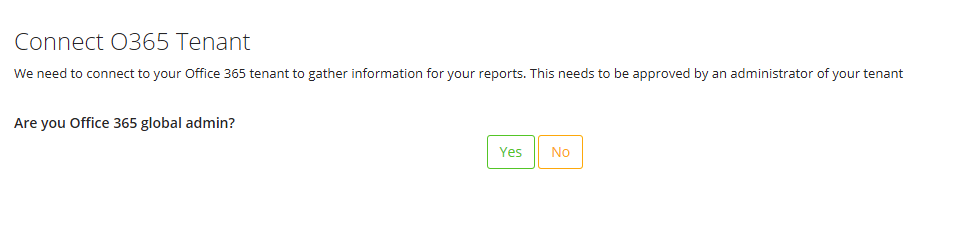
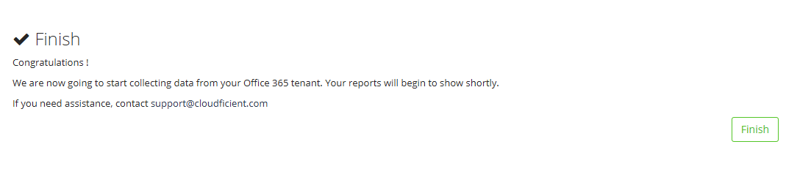
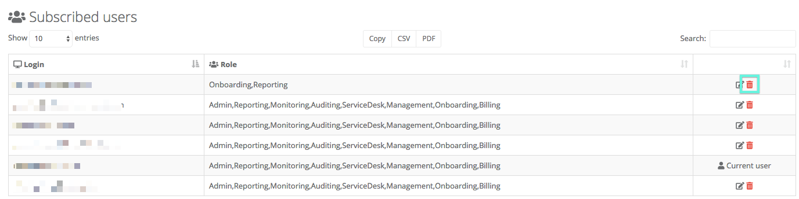

# InFlight

## Welcome

You are now reviewing the documentation for our product.

Our aim with this documentation is to give you an overview of what you can see inside the application,
along with example of how to find out specific things relating to your environment. We've based these examples on information that some of our customers have provided, and asked us about whilst developing the product!

## Getting started

We have made it super-easy to navigate within our product. The information to help you make better decisions relating to your Office 365 tenant, is just a click away!

As a reminder, we need to go through a process called **consent** in order to be able to collect reporting and auditing data from your tenant. You can find out more about that [here](#data-collection).

In the menu on the left are general examples of what we include in most of our reports, as well as some specific use cases.

### Getting Started Wizard

When you have created a new subscription, you can enter the application and run through the Getting Started Wizard.

It starts with this screen:

The advanced Office 365 reporting application has to have permission from one of your Office 365 Global Administrators in order to be able to collect data from Microsoft about your tenant.
So the first question which is asked is whether you are a Global Administrator:

If you are a Global Administrator of your Office 365 tenant, click on 'Yes' and you can continue. If you aren't, you will see this:

They will get an email asking them to complete the 'application consent'.

If you are the global admin, or your global admin gets the email and starts the wizard, they will see this:

When you click on consent you are redirected to the Microsoft Office 365 portal. If you're session is still valid you will get this:

**Note:** If your session isn't valid, you'll need to login to your subscription, before the above will appear.

There are a few more steps in the wizard: info about our upcoming on-premises agent, and the ability to enter some additional O365 credentials for us to run PowerShell scripts (to collect even more data)… and eventually you'll get the following.

## User management

The person that signs up your Office 365 tenant to our application is known as the tenant admin. They have the ability to grant access to additional people, as shown below.

### Adding a new user

From time to time you might want to give the ability for additional people to be able to login, and use the application. If that's what you want to do, follow these steps:

1. Click on `Settings` in the left hand navigation bar.
2. Click on the `Security` tab.
3. You will be presented with a list of the users who have access to the application.
4. At the bottom left of the data grid click on the `Add user` button.
5. Provide the user principal name of the person you want to give access to.
6. Select the components of the application that you wish this person to have access to, and confirm by clicking on the `submit` button.

### Changing the roles of a user

From time to time you might want to change the roles associated with people who have access to the application. If that's what you want to do, follow these steps:

1. Click on `Settings` in the left hand navigation bar.
2. Click on the `Security` tab.
3. You will be presented with a list of the users who have access to the application.
4. You can edit the user roles by clicking on the small `edit` icon to the right of the user in the data grid.
    

### Removing a user

From time to time you might want to remove people from access to the application. If that's what you want to do, follow these steps:

1. Click on `Settings` in the left hand navigation bar.
2. Click on the `Security` tab.
3. You will be presented with a list of the users who have access to the application.
4. You can remove a user by clicking on the small delete icon to the right of the data grid.
    
5. A pop-up dialog will give you the options for the user. Components of the application can be added and removed, and changes confirmed by clicking on `submit`

## Data collection

### Collection by consent

When you launch our Advanced Office 365 Reporting for the first time a short wizard will guide you through additional information
which we need to collect.

The most important part of this step is that a Global Administrator for your Office 365 tenant needs to approve our application. This
process is called **providing consent**, or **consenting**.

This is a standard procedure for applications built to work alongside Office 365. If you are a global administrator you can provide
the necessary consent, and move on in the wizard. If you are not a global administrator you can provide the email address of one, we will
email that user and ask them to click on a link which will grant the consent. You will then be able to continue with the wizard.

### What does all this mean?

By following this Microsoft recommended method of providing consent, it is not necessary to store credentials in order to gather
data for many of the reports which are available in the product.  Using the consent we can listen to various Microsoft data streams
relating to your tenant and using that collected metadata we can begin to show you reports and auditing information relating to your tenant.

### Additional credentials

During the wizard you will notice that we do ask for credentials. Those credentials are stored securely and used to obtain further
information, using PowerShell, to provide even more reports for you.  

If you don't provide credentials certain reports won't have data in them, but there will be a friendly reminder telling you.
Credentials can be entered later, and the reports will be available from then.

## What's next?

Once you get to the end you will be inside the application itself. In the background the process to collect data about your Office 365 usage will have already begun.
Usually within a few minutes data will start to appear on the charts and data tables inside the application.
