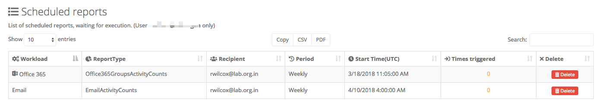
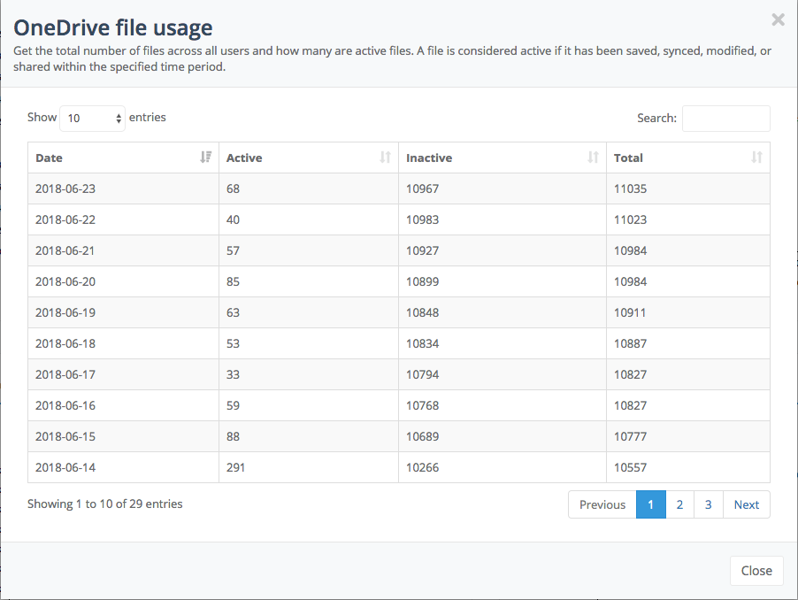

# Welcome

You are now reviewing the documentation for our Advanced Office 365 Reporting application.

Our aim with this documentation is to give you an overview of what you can see inside the application,
along with example of how to find out specific things relating to your environment. We've based these examples on information that some of our customers have provided, and asked us about whilst developing the product!

# Getting started

After you have completed the configuration by using our getting started wizard; we can begin capturing reports from the specified servers.  This data is then stored securely in our system and made available for you to perform queries against to discover valuable information relating to usage and operations being performed in your Office 365 tenant.

For further information on using the reporting module, review the menu on the left.

# Overview
Below is a screenshot showing the main reporting screen:

The page is divided into a number of sections as described below.

# Scheduling a report

After discovering useful information about your Office 365 usage, you might want to track that progress over a period of time.

## Adding a scheduled report

Many of our reports can be scheduled to sent out to you via email at preconfigured intervals. If this is something you want to do, follow these steps:

1. Click on `Reporting` in the left hand navigation bar.
2. Click on the `Scheduled reports` tab.
3. Select the date range for the report.
4. Choose the workload from the dropdown list.
5. Choose the individual report from the final dropdown list.
6. Click on the `Load` button to see the report.
7. Each report generally consists of a number of charts, and an accompanying data table.

8. If this is the report you wish to be scheduled, click on the icon of a clock at the top right of the data charts.
9. The pop-up window allows you to choose when the report will be sent out in terms of time and frequency.  It's even possible on this pop-up to view the report immediately in PDF format for immediate download.

Scheduling a report is easy. The next section describes how to view the reports which you've already scheduled.

## Viewing scheduled reports

1. Click on `Settings` in the left hand navigation bar.
2. Click on the `Scheduled reports` tab.
3. You will be presented with a list of scheduled reports:

## Removing a scheduled report

From time to time you might want to remove previously scheduled reports. If that's what you want to do, follow these steps:

1. Click on `Settings` in the left hand navigation bar.
2. Click on the `Scheduled reports` tab.
3. You will be presented with a list of scheduled reports:

4. Click on the `Delete` button to the right of the report in the data grid.
5. The report will be deleted, and you will no longer receive it at the scheduled time via email.

# Examples

## Chart data

There are several types of chart in the application. An example of one is shown below:

These responsive charts display useful information about part of your Offiec 365 experience,
and in many cases you can hover over a segment of the chart to see clearer details about. On some charts, like the one
below you, you can click on a segment to zoom-in on the activity:

... and when you click on the segment relating to 'sent' activities the chart changes to this:

## Tabular data

Whenever possible inside the application we like to provide data to reinforce and support the chart data. As
an example, here is some tabular data

These tables help reinforce the message which the accompanying chart shows. In addition, there
are several other features available with the data tables:

- Copy the data to the clipboard
- Export the data in PDF or CSV format
- Change the number of results returned (to make the table longer or shorter)
- Page through the results
- Search the results
- Sort the results, by clicking on a column heading

## Files in OneDrive

Many organizations deploy OneDrive for Business. This has many advantages and can help remove the need for ordinary file servers.  One question you, as an administrator, might have is:

	> How many files are in OneDrive?

If you want to find out the answer to this question, follow these steps:

1. Click on `Reporting` in the left hand navigation bar.
2. Click on the `OneDrive` tab.
3. Near the bottom left of the page will be a chart showing the overall number of files over the last 30 days:

4. You can, if you need to, change the date range of this report to look back at longer periods of time, or at a specific time range.
5. There is also a data-table available in a pop-up window should you need to get exact numbers.

## Email activity

Emails are still the lifeblood of many organizations. But do you know how many are being sent, received and read in your organization?

If you want to find out the answer to this question, follow these steps:

1. Click on `Reporting` in the left hand navigation bar.
2. Click on the `Email` tab.
3. At the top left of the page is a chart showing you the number of items that were sent, received and read over the last 30 days.

5. You can, if you need to, change the date range of this report to look back at longer periods of time, or at a specific time range.
6. There is also a data-table available in a pop-up window should you need to get exact numbers.
