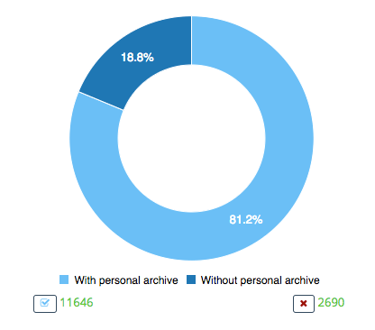

# Example chart

There are several types of chart in the application. An example of one is shown below:

These responsive charts display useful information about part of your Offiec 365 experience, 
and in many cases you can hover over a segment of the chart to see clearer details about. On some charts, like the one
below you, you can click on a segment to zoom-in on the activity:

... and when you click on the segment relating to 'sent' activities the chart changes to this:

