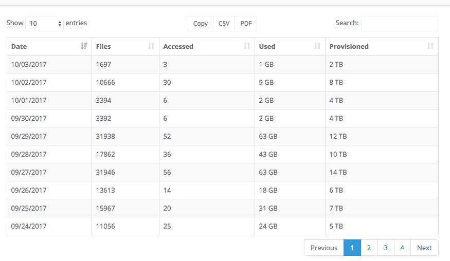

# Example data

Whenever possible inside the application we like to provide data to reinforce and support the chart data. As
an example, here is some tabular data 

These tables help reinforce the message which the accompanying chart shows. In addition, there
are several other features available with the data tables:

- Copy the data to the clipboard
- Eexport the data in PDF or CSV format
- Change the number of results returned (to make the table longer or shorter)
- Page through the results
- Search the results
- Sort the results, by clicking on a column heading