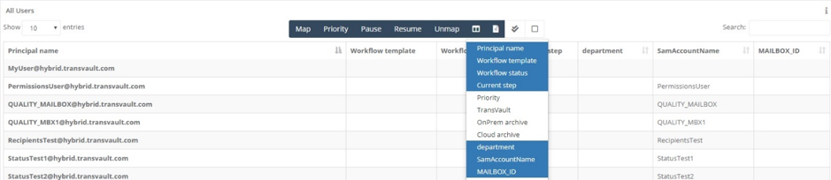

### Configuring Active Directory environment

The Active Directory tab is where you will find all the settings and configuration required with regards to the On-premises Active Directory.

**Agent -** This is the server where the agent is installed.

**Credentials -** The credentials are those of either the exchange admin or domain admin.

### Scheduled jobs

At the bottom of the Environment tab you will see the scheduled job list. You can edit a task by clicking on the edit icon in the list of available hosts.

The jobs available are as follows:

**GetAdGroupsAndMembers -** Gets all AD groups and members in a Domain.

**GetSitesInDomain -** Fetches AD Sites for a Domain (admin required).

**GetSubnetsInDomain -** Fetches IP Subnets for a Domain (admin required).

**GetUsersInDomains -** Gets all users in a Domain.

### Configuring Exchange environment

Once the agent has been installed (typically this would be the Exchange On-premises server which would act as the PowerShell host where the exchange management shell is located), you will be presented with various tabs.

The Exchange tab is where you will find all the settings and configuration required with regards to the Exchange server.

**Environment name -** This is a memorable label / name that you can apply that helps you to distinguish the environment being referenced.

**Exchange PowerShell Host -** This should be set to the server that contains the Exchange management shell and contains the PowerShell host for the environment.

**Agent -** This is the server where the agent is installed.

**Credentials -** The credentials are those of either the exchange admin or domain admin.

### Scheduled jobs

At the bottom of the Environment tab you will see the scheduled job list. You can edit a task by clicking on the edit icon in the list of available hosts.

The jobs available are as follows:

**TestMRSHealth -** This job tests / checks the MRS health of an instance of the Microsoft Exchange Mailbox Replication service.

**GetMigrationEndpoints -** GetMigrationEndpoints will retrieve all available migration endpoints within a Hybrid Environment.

**GetRemoteMailbox -** The GetRemoteMailbox job will run PowerShell commands in order to establish which mailboxes are in O365.

**GetExchangeServers -** This job will get all the On-premises Exchange servers.

**GetOnPremMailbox -** When this job runs it will fetch all information related to the On-premises mailboxes.

**GetOnPremMailboxStatistics -** This job will get all On-premises Mailbox Statistics of the On-premises Mailboxes.

**GetOnPremPersonalArchiveStatistics -** This job will fetch all On-premises Personal Archive Statistics (for example number of items and how many folders etc).

### Configuring TransVault environment

In this tab you can configure the TransVault scheduled jobs that relate to the TransVault Migration server. These jobs can be run at any time from the scheduled jobs window.

**Environment name -** This is a memorable label / name that you can apply that helps you to distinguish the environment being referenced.

**SQL Server -** This should be set to the SQL Server that hosts the TransVault database.

**Database name -** The TransVault database default (?TBD?).

**Agent -** This is the server where the agent is installed.

**Credentials -** The credentials are those of either the exchange admin or domain admin.

### Scheduled jobs

At the bottom of the Environment tab you will see the scheduled job list. You can edit a task by clicking on the edit icon in the list of available hosts.

The jobs available are as follows:

**GetTVConnections -** This job fetches the configured connections in a TransVault Environment.

**GetTVMailboxes -** Fetches the mailboxes/archives seen in a TransVault Environment.

**GetTVPerformance -** Fetches the performance statistics for a Migration Queue.

**GetTVQueues -** Fetches the configured queues in a TransVault Environment.

**Agent notes** : When installing the agent, it&#39;s important to note that you must have one agent per datacentre. The agent is forest specific as well i.e. if you have more than one Exchange server in different forests in different locations, then each one will need its own agent. Likewise, in a cross domain scenario, this would also require multiple agents.

## Moving a mailbox to Office 365

A typical workflow template to move an on-premises mailbox into Office 365 might contain the following steps.

1) **Communication Step - *Mail User*.**  
Advise the user in advance that their mailbox will be moved into Office 365 in X number of days.  This step requires a MSG template file and can contain personalised details like FirstName and LastName to ensure the email is tailored for the end user.

2) **Communication Step - *Mail administrator*.**  
Send an email to a specific administrative email address confirming that the user has been successfully notified.  This step also requires a MSG template file.

3) **Wait Steps  - *Wait Time*.**  
Set a timed delay for X amount of days/hours etc before the next step is processed.

4) **Office 365 - *Preflight primary to cloud*.**  
Run checks against the on-premise Exchange to ensure the account exists and the email address is valid.

5) **Office 365 - *Move primary to cloud*.**  
Initiate the move of the users mailbox into Office 365.

6) **User and License Steps - *Assign a license*.**  
Assign an Office 365 license to the recently created users mailbox so that it can be accessed.

7) **Communication Step - *Mail User*.**  
Email the user and advise them that their mailbox has now been moved into Office 365, and that they will need to restart Outlook.

You can add in more wait steps or communication steps as are required for your specific project, but this process forms a simple framework for moving a users mailbox into Office 365.

## Additional columns for data grid

You can modify which columns are displayed in the Mapping screen.  To add in additional columns, go to Settings --> On-Boarding (This is only accessible with the OnBoard admin permission)

Select which columns you would like to add from the available list on the right hand panel, Extended Properties i.e. add in fields from AD, Exchange, the TransVault mailbox table etc

Click Save when you are happy with your selection, then go back to the Mapping screen.  Onboard --> Mapping

Click on the Select columns icon to see your new list of available fields 

You should now see the new columns available in the dropdown and can select/de-select them as required

