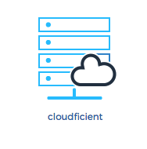
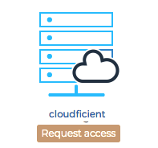

# Logging in

Logging is simple, just go to our portal page and click on 'Sign in' at the top right or 'sign up' in the center of the page.

You will be shown a list of your active subscriptions, like in this screenshot:

To get into the application simply click on one the icon.

# Requesting access

If your list of subscriptions looks like this you can send a request to gain access to the application;

When you request access we will contact administrators of your tenant who can approve your request.