# Deploying TeamSearch

## Prerequisites
To deploy TeamSearch into your Azure Tenancy, **you must have a subscription already set up**. If you do not have a subscription, please review the following Microsoft documentation on how to create one [https://azure.microsoft.com](https://azure.microsoft.com/en-gb/blog/create-enterprise-subscription-experience-in-azure-portal-public-preview/)

Once you have identified the subscription in which to install TeamSearch, please pass your Azure tenant ID, subscription name and ID to [teamsearch.support@transvault.com](mailto:teamsearch.support@transvault.com) This is so we can make the TeamSearch application available to you from within the Azure Marketplace. You will receive an immediate automated response and TransVault will reply to your request within 24 hours to advise you that access has been granted, at which point you can continue to the next step.

## Deployment

1. Click “**Create Resource**” – background information on what resources a required and what ownership/access they have can be found here: [https://docs.microsoft.com](https://docs.microsoft.com/en-gb/azure/managed-applications/overview#resource-groups-for-managed-applications)
2. Then create a **App Service plan**. TeamSearch will be hosted as a web application in this service plan.
  * Create resource
  * Search for App Service Plan (see all option) e.g. ```[S1/E3 etc]``` – choose the service plan that best suits your enterprise.

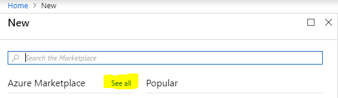

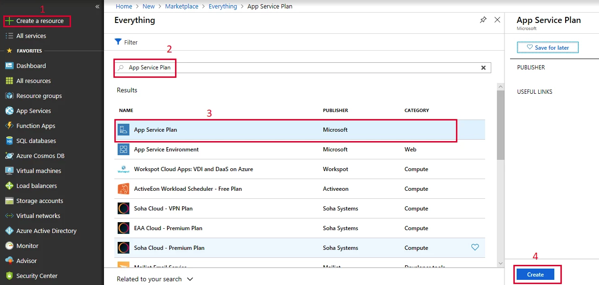


  * Name the App Service Plan and the Resource Group [review resource groups](https://docs.microsoft.com/en-gb/azure/managed-applications/overview#resource-groups-for-managed-applications). 

You will need this information later on, so we suggest that you name relative to what they are for e.g. ```AppServicePlanForTeamSearch``` for your app service plan and ```ResourceGroupForTeamSearch``` and take a note of what they are (you will need this information later on). 

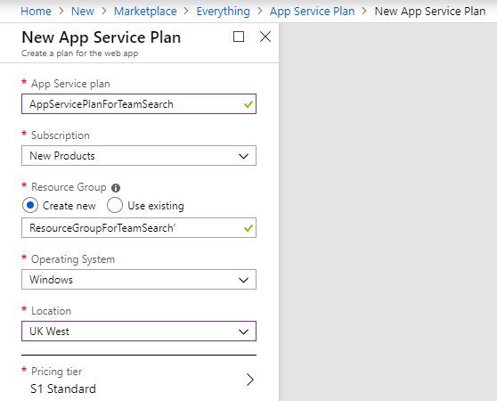

The names shown in the screen shot above are suggestions, you may name as you wish.
By creating this resource group, it will enable you to change the Pricing tier in the future, if you should need to.

3. Next search for TeamSearch in the Azure Marketplace
   1. Create Resource
   2. Search for “TeamSearch”
   3. Select TeamSearch
   4. Click “**Create**”


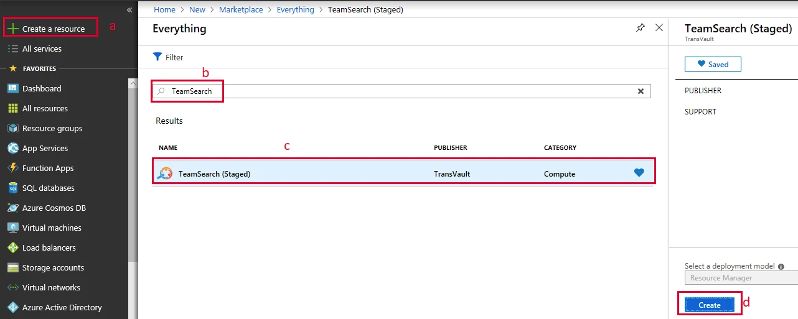

## Configuration

### Application settings

1. Select the subscription to be used for application. 
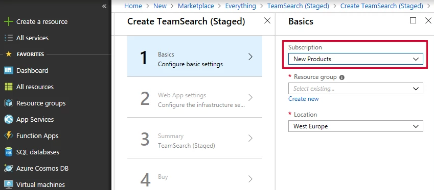

2. Create a **new resource group** for the managed application. Use a unique name for the resource group. It is also possible to use existing resource group, but the group should be empty. We suggest that you name them with suffixes e.g. ```ManagedAppResourceGroup```.
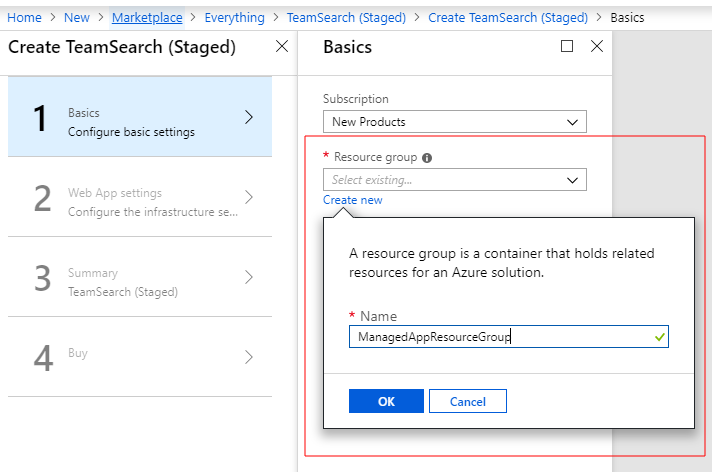

3. Select a location and click **OK**
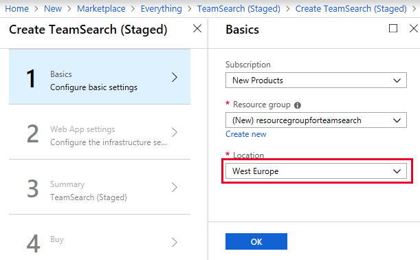

### Web App settings

1. Enter the name of the resource group which hosts the app service plan (from prerequisites) e.g. ```ResourceGroupForTeamSearch```
2. Enter the name of the app service plan (from prerequisites) e.g. ```AppServicePlanForTeamSearch```
3. Type **unique client name** (this must be globally unique, so we recommend using a GUID) web client name.  
 
That will be an enter point of an application ```https://{client name}.azurewebsites.net``` e.g. your companies unique domain (transvaultcom)


4. Click "**OK**"

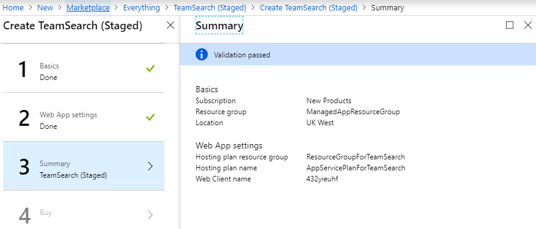

5. Confirm pricing and agree to the terms and conditions.

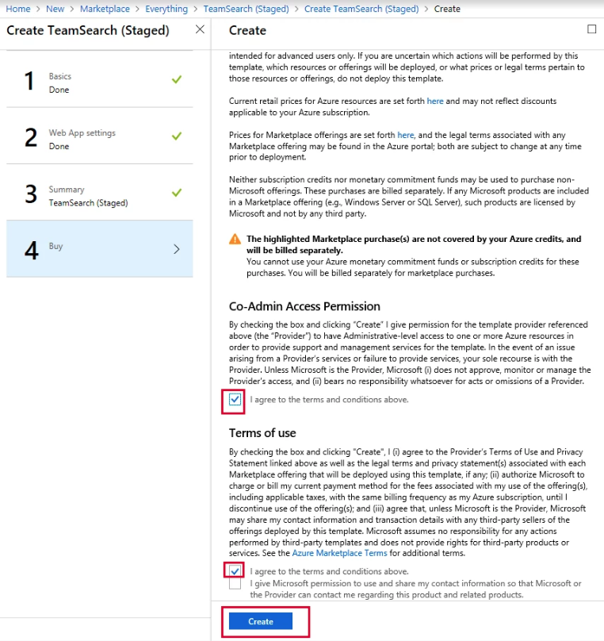

The deployment process will now commence. You may need to wait several minutes until this complete.

Your recently configure environment will now look something like this:
Open Resource Groups from the portal main navigation menu.
You should see the resource group you created e.g.
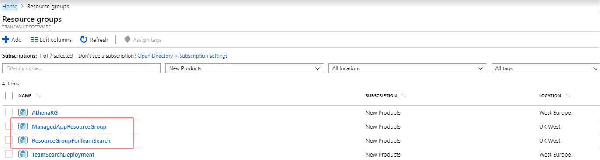

Clicking on **ManagedAppResourceGroup** you will see:
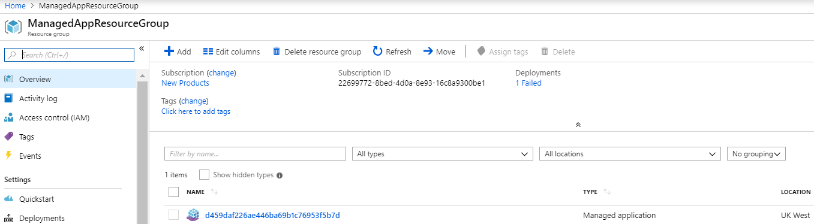

If you now go back to the resource groups can click on **ResourceGroupForTeamSearch** you will see:
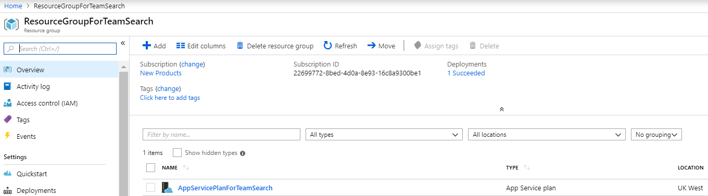

Once the template has installed, contact [teamsearch.support@transvault.com](mailto:teamsearch.support@transvault.com) with the application resource group name to complete your installation:

* TransVault will check that the your TeamSearch managed application is visible to us
* TransVault will run some final deployment scripts
* TransVault will add licensing configuration (N/A during free trial period)
* TransVault will provide a link for the Global Administrator so, once clicked, it will trigger an action to enable the deployed TeamSearch application to perform specific operations within the Office365 environment (e.g. read information from mailboxes, Teams and Yammer).
* Once you have accepted the consent, you may see the page redirect to a page URL like ```http://localhost``` the page will display a message like “*Can’t connect securely to this page*” – do not be concerned about this. Please continue to the next step (activate your license).

## Activate license
You will need to activate your trial license: [https://portalmng4c8961a4946bfac851-dev.azurewebsites.net/](https://portalmng4c8961a4946bfac851-dev.azurewebsites.net/)


## Assign users
If you want to select who can access TeamSearch you must set the **User assignment required? toggle button** in your TeamSeach App Properties within your Azure Portal to Yes. You can find this setting in the Enterprise applications All applications page. If you cannot see it in the list, try searching for it on this page. Once it is presented, click on TeamSearch. You will now see the TeamSearch App Overview page. Select Properties in the menu on the left hand side. You will now see the 'User assignment required?' toggle button. **Note if you only want a subset of all of your AD user to see your TeamSearch you must toggle this setting to Yes**

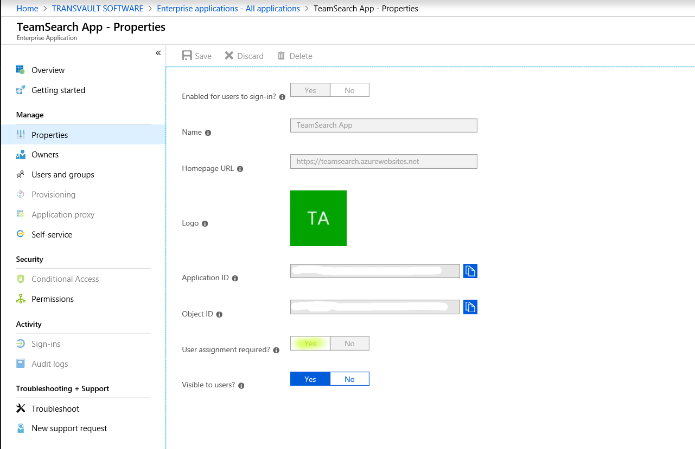

If you have selected Yes, you can now assign users or groups to TeamSearch. Further information on how to achieve this can be found in the following Microsoft guidelines:	
[https://docs.microsoft.com](https://docs.microsoft.com/en-us/azure/active-directory/manage-apps/assign-user-or-group-access-portal)

## Custom domain

1. In your azure portal, go to **AppServices** and Select the ```TeamSearch Web Client Application```. Click on it, so that you its properties and settings.

2. From the menu on the right hand side select **Custom domains**.

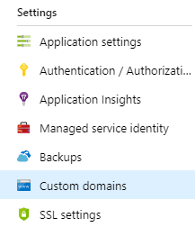

3. Click **Add hostname**.

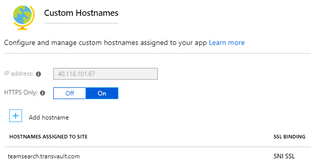

Enter the new Host Name URL you want to use.
Click on **Validate**.
Select your Hostname record type ```CNAME``` or ```A Record```. You will then be given the name in which you will need to apply within your external DNS provider. Make sure you have setup your hosted DNS records to point to the new URL of the Applications Homepage URL.
- If done correctly when you click again on validate the Hostname availability and Domain 

Ownership is represented by the presence of a green tick (hostname availability). However, if you see a red cross, check the validation message and take steps to rectify.

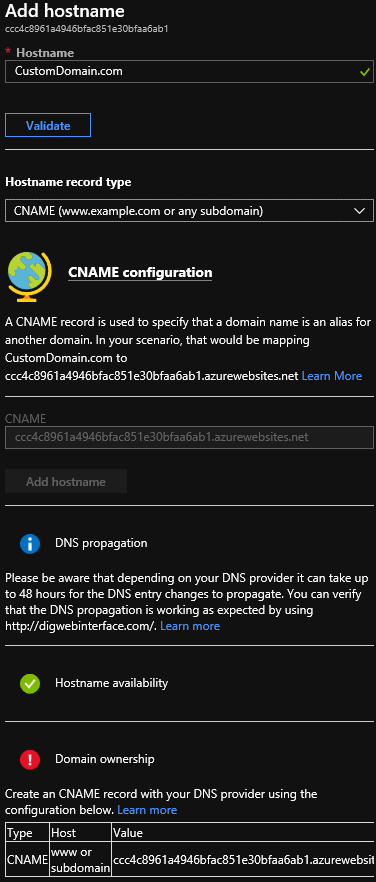

## SSL certificate
If you wish to add SSL Cert (Recommended but not needed)

1. Select the **AppServices** and Select the ```TeamSearch Web Client Application``` as described in ```step 1```. 

2. This time, select the **SSL settings** in the settings section.

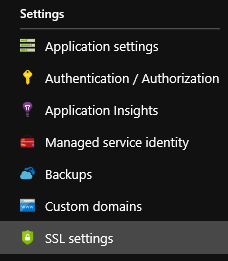

3. Select the tab **Private Certificates** (.pfx) or Public Certificates (.cer) dependant on the Cert you have. (Verisign, Globalsign etc).

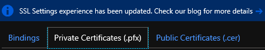

4.  Now select **Upload certificate**.


Next:

a. Browse to the location of the certificate file.
b. Enter the Certificate password if using a PFX file. 

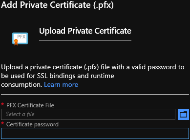

5. Then click on **Upload certificate** at the bottom of the screen.

## Redirect URL

Redirecting your TeamSearch URL

1. Go to **Azure Active Directory** and Under **Manage** click on **App registrations**

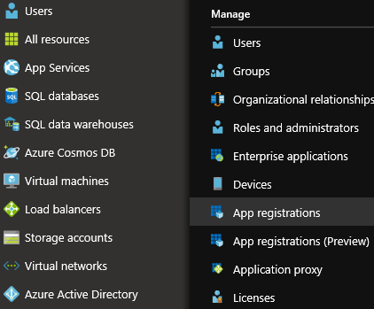

2. Search and then Click on the ```TeamSearch Application```.

3. Click on **Settings** (cog wheel)

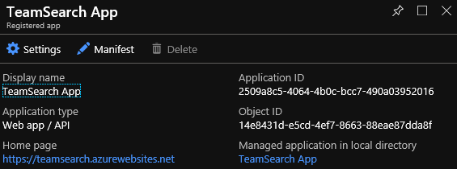

4. Click on **Reply URLs**

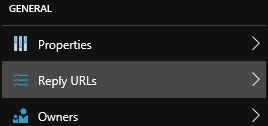

5. Scroll to the bottom and enter the new Custom URL i.e. ```https://teamsearch.companyname.com/*```

NB - Make sure to append an **_asterisk_** to the URL.

6. Scroll up and Click on **Save**.


