# TeamSearch 

You are now reviewing the TeamSearch help documentation.

TeamSearch enables searching across multiple sources, delivering a single pane of results. TeamSearch will save you time and frustration looking for information in each application, it will provide you with a birds eye view of your query across disparate message silos.
See [https://teamsearch.it/](https://teamsearch.it/) for further information.

The TeamSearch parameters, filters and results grid provide you with powerful, hi-fidelity, cross message querying. TeamSearch which help you save time and frustration and speed up collaboration within team workflows. It will help you locate critical business information in an ever-increasing message-based organisation.

Our aim with this documentation is to give you an overview of what you can see inside the application,
along with example of how to find out specific things relating to your environment. We've based these examples on information that some of our customers have provided, and asked us about whilst developing the product!

## Logging In

Open your browser and type in the URL for TeamSearch set-up by your IT Administrators.

Hit return.

You will then be requested to submit your office 365 credentials.

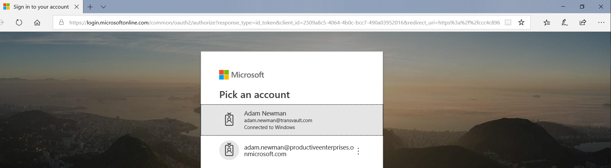

Once you have passed authorization, you will be taken to the TeamSearch screen:

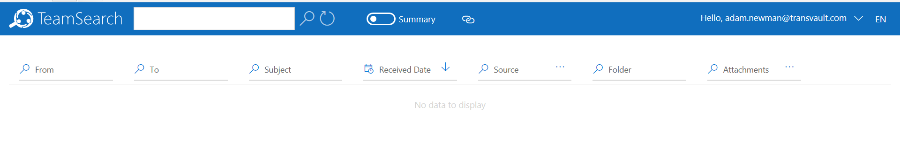

## Searching

### Keyword parameter

You can put a keyword parameter into the text box at the top of the screen and either use the Enter/Return key or push the magnifying glass icon:

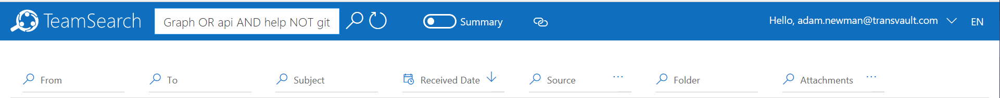

You can use logical operators &quot;AND&quot;, &quot;OR&quot; and &quot;NOT&quot; (note capitals) to supplement keyword searching.

In the example &#39;Graph OR api AND help NOT git&#39; the user is searching for the keywords (&#39;Graph&#39; or &#39;api&#39;) and the keyword &#39;help&#39;, but they are also stating that they do not want results that match those terms to contain the term &#39;git&#39;.

You can also search for phrases written inside &quot;speech marks&quot; e.g. &quot;what is the correct endpoint for the Graph api?&quot;. If you did not supply encapsulate this phrase in speech marks you would get a many more results across the different elements of the search term. Using speech marks is very powerful way to pinpoint results across message sources.

Once you have submitted your search, the results will be presented in a table below.

If you double click on one of those results or choose the Preview option from the ellipsis icon on the right-hand side of the result row, you will be presented with a preview

You can see that the keywords have been highlighted and are in context to the search keywords you have submitted.

## Results

Once you have submitted your search, you will be presented with the results

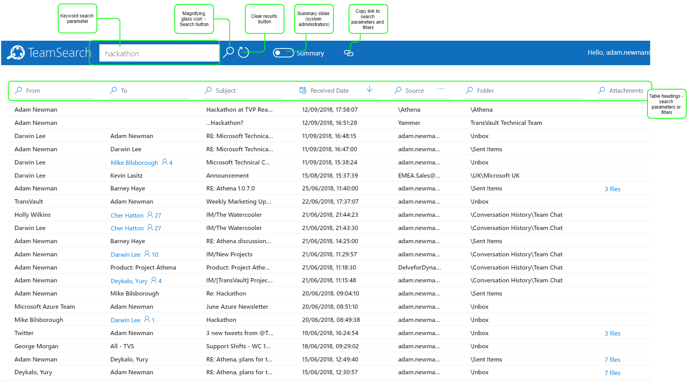

You can use the results table to look at the information and decide if you need to either narrow the results by filtering in the current results set or you may wish to add or change parameters of the results to refine your search.

First let&#39;s look at filtering your results

### Filtering

If you searched using keywords, you can supplement the keyword with other words, phrases or logical operators. As you tab out of the keyword textbox, if there are matching results in the existing results, the results set will filter to match, note pressing Enter/Return or pushing the looking glass button will trigger a fresh search based on those parameters. You do not have to use a keyword, you can use the other parameters as well or independently such as &#39;To&#39;, &#39;From&#39;, &#39;Subject&#39;, &#39;Received Date&#39;, &#39;Folder&#39; and &#39;Attachments&#39;; each one of values set in these search fields will either filter your current search results (after entering a value in the field, tab out) or act as search terms for new search&#39;s triggered by Enter/Return keystrokes or pressing the search button.

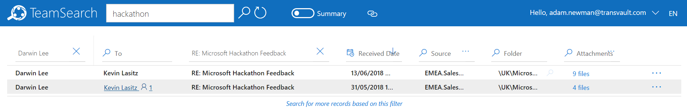

In the above example the keyword &#39;hackathon&#39; has been filtered by a &#39;From&#39; value of Darwin Lee and a &#39;Subject&#39; of &quot;Re: Microsoft Hackathon Feedback&quot;. For filtering on existing results set you can save the time to type in the &#39;From&#39; and &#39;Subject&#39; value by pressing the small looking glass icons next to the value in the row of the chosen result.

To remove the filter, click the &#39;X&#39; next to the filtered value in the heading above the selected column.

### Refining search

Refining the search with parameters.

The results table headings - &#39;To&#39;, &#39;From&#39;, &#39;Subject&#39;, &#39;Received Date&#39;, &#39;Folder&#39; and &#39;Attachments&#39; - can be used as search parameters. They can be used independently from each other and the keyword term, or they can be use together to make powerful queries across your sources.

For example, with reference to the image:

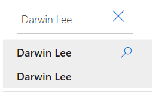

You can simply press Enter after &#39;Darwin Lee&#39;.

Received Date can be altered by selecting a value from the drop-down list:

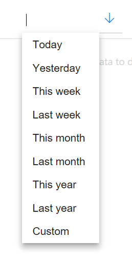

You can also specify a custom date range by using calendar controls within the &#39;From&#39; and &#39;To&#39; date ranges.

If you mouse into the Source heading, you will be presented with a selection of message sources to search/filter on:

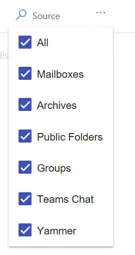

You can choose all, some, or one of the various sources. The selection you make here will help you if you feel confident that a message is in one or two sources, but by selecting all you can get a &#39;birds eye&#39; view of messages across all the information you have access to.

Folders can help determine greater fidelity within the underlying message storage, so for example, emails in your inbox maybe sub-divided into different folder structures or Teams can hold multiple chats within a channel. Filtering or using parameters in this column again provide high fidelity search control.

Attachments are useful when you are looking for files you may have been sent e.g. meetings agendas and minutes. Perhaps you want to locate the sales figures spreadsheet that you can never quite remember where if you colleague sent it by email or stored it in a Team.

## Access to source applications

When you locate an item of interest from the result grid, you can open the source application (Outlook, Yammer or Teams (for Channel chat only)) via the ellipsis (�) icon at the far-right hand side of the row. Clicking this icon will present options depending on the underlying message type, to open those applications, so that you can invoke the native functionality within those applications.

 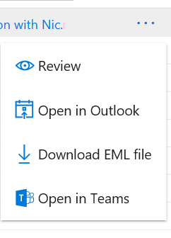

 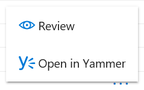

## Add to the record

If you have an email in your personal mailbox and you feel that the information within it should be made available to your colleagues; not just a nominated few, but everyone, whether they are employees now or maybe in the future. There is a way to share the email via Quick Steps in Outlook and shared folders.

Create a new Quick Step.

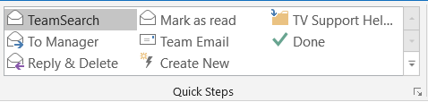

Name it e.g. TeamSearch or Add to record

Choose some actions e.g.

Mark as read and then Copy to folder:

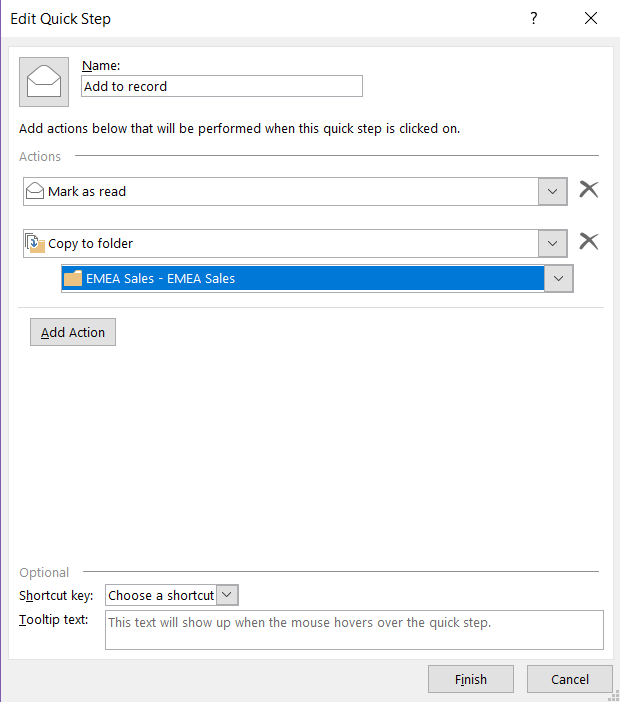

Choose the shared folder relevant to the information.

Then click Finish.

When you next receive an email that you want your colleagues to be able to search on.

Open it and click the Add to record Quick step.

You can then search for the message in TeamSearch, it will appear in the shared folder.

## Language choice

TeamSearch can display text in multiple languages. Click on the EN in the top right-hand corner of the screen and select a language.

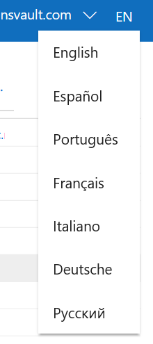

## Date and time

Date and time settings are dependent on those set in your browser. To alter them to your preferred format, see your chosen browser settings.

**Chrome**:
Date and time is tied to the Language setting

**Edge**:
The date time formatting is affected by the settings in Windows (type Date & Time into the windows search box in Windows 10). Choose to set -Set time zone automatically� to show dates and times in the format of your location or alternatively you can select �Change date and time� to change dates and times manually.
